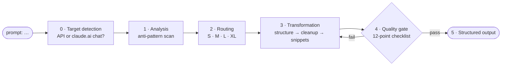

# 🧠 Claude Fable 5 Prompt Optimizer

### Turn any raw prompt into a Fable-5-ready, source-backed prompt — in seconds.

[](https://github.com/CheswickDEV/claude-fable-5-prompt-optimizer/stargazers)
[](https://github.com/CheswickDEV/claude-fable-5-prompt-optimizer/network/members)
[](https://github.com/CheswickDEV/claude-fable-5-prompt-optimizer/blob/main/LICENSE)
[](https://www.anthropic.com)
[](https://github.com/CheswickDEV/claude-fable-5-prompt-optimizer/pulls)

A **claude.ai Project** that rewrites raw prompts for Claude Fable 5 (`claude-fable-5`) — Anthropic's Mythos-class model **above** the Opus tier. Type `prompt: <anything>` and get back an optimized prompt, a change log citing the exact rule behind every edit, and (for API use) a parameter recommendation. All 43 rules trace to official Anthropic documentation.

---

## 📋 Table of Contents

* [⚡ Before & After](#-before--after)
* [🚀 Quick Start](#-quick-start)
* [🎯 The `prompt:` Trigger](#-the-prompt-trigger)
* [✨ Features](#-features)
* [🆕 What's New in Fable 5](#-whats-new-in-fable-5)
* [🔄 How It Works](#-how-it-works)
* [📏 The 43 Optimization Rules](#-the-43-optimization-rules)
* [📂 Repository Structure](#-repository-structure)
* [📚 Sources](#-sources)
* [⚠️ Limitations & Open Points](#limitations)
* [🤝 Contributing](#-contributing)
* [📄 License](#-license)
* [⚠️ Disclaimer](#disclaimer)
* [⭐ Star History](#-star-history)

---

## ⚡ Before & After

**You type:**

```
prompt: Please summarize the attached market report. IMPORTANT: You MUST be
extremely thorough and explain your reasoning step by step so I can follow how
you got to each conclusion. Don't miss anything. [30,000-word report pasted here]
```

This looks harmless — but on Fable 5 it contains **one safety-refusal risk, one documented quality killer, and one structural mistake**.

**The optimizer detects:** no API signals → chat target; long-document knowledge work → Route M. Three anti-patterns flagged.

**You get back:**

```text
<optimized_prompt>
  <user>
<documents>
  <document index="1">
    <source>market report</source>
    <document_content>
{{DOCUMENTS}}   <!-- paste the full report text here -->
    </document_content>
  </document>
</documents>

I'm preparing a decision basis from this market report for [who will
read it]. They need [what the summary enables, e.g., a go/no-go call].
With that in mind: summarize the report.

First extract the quotes most relevant to the conclusions, then write
the summary grounded in those quotes. Lead with the key findings. Keep
it short by being selective, not by compressing the writing;
readability over brevity.
  </user>
</optimized_prompt>
<changes>
  - Removed "explain your reasoning step by step" (R8, R40): instructing
    Fable 5 to reproduce its reasoning in the answer can trigger a
    reasoning_extraction refusal; conclusions stay, derivations stay
    internal.
  - Removed "IMPORTANT: You MUST…" and "Don't miss anything" (R38, R39):
    aggressive trigger language and thoroughness appeals cause
    overtriggering on current models; the task statement suffices.
  - Moved the report above the instruction, query at the end, document
    in <documents> structure (R5): documented up to +30% answer quality
    for 20k+ token inputs; added quote grounding for a long document
    (R5).
  - Added an intent line with placeholders (R2): Fable 5 measurably
    performs better knowing purpose and audience.
  - Added a brevity instruction (R12): unsteered, Fable 5 elaborates;
    "thorough" was replaced by selective completeness.
</changes>
<open_questions>
  - Who is the audience and what decision does the summary support?
    (fills the [bracketed] placeholders)
  - Target length or format (prose vs. bullet points)?
  - If you plan to run this via the Claude API instead of chat, say so —
    I will add a parameter recommendation.
</open_questions>
```

**What just happened:**

1. The biggest fix is invisible: *"explain your reasoning step by step"* went from harmless 4.x style advice to a **safety-refusal risk** — the optimizer removed it and kept your actual need (traceable conclusions) via quote grounding, which surfaces source quotes, not internal reasoning.
2. The shouting (*"IMPORTANT: You MUST…"*) didn't make the model more thorough — on Fable 5 it's a documented overtriggering cause. Deleted, nothing lost.
3. The report moved **above** the question (documented up to +30% answer quality for 20k+ token inputs), got proper `<documents>` scaffolding, and your intent — the thing Fable 5 measurably benefits from most — now has a dedicated line.
4. Everything the optimizer couldn't know, it asks in `<open_questions>` — *after* delivering the result, never instead of it.

An agentic API example with a full `<parameters>` block (effort, max_tokens, streaming, fallbacks, caching, task budget) lives in [`knowledge/06-worked-examples.md`](knowledge/06-worked-examples.md), example 2.

---

## 🚀 Quick Start

### Option A: Claude Project (recommended)

1. Open [claude.ai](https://claude.ai) and create a new **Project** (e.g., "Fable 5 Prompt Optimizer")
2. Paste the contents of [`project-instructions.md`](https://github.com/CheswickDEV/claude-fable-5-prompt-optimizer/blob/main/project-instructions.md) (everything below the divider) into the **Project Instructions** field
3. Upload all six files from [`knowledge/`](https://github.com/CheswickDEV/claude-fable-5-prompt-optimizer/tree/main/knowledge) as **knowledge files** in the project

Start a conversation — type `prompt: <your raw prompt>` and the optimizer handles the rest.

### Option B: Claude API

Concatenate the instructions and knowledge files into one system prompt:

```python
import anthropic
from pathlib import Path

client = anthropic.Anthropic()

system_prompt = "\n\n".join(
    p.read_text(encoding="utf-8")
    for p in [Path("project-instructions.md"), *sorted(Path("knowledge").glob("*.md"))]
)

response = client.messages.create(
    model="claude-fable-5",
    max_tokens=64000,
    system=system_prompt,
    output_config={"effort": "high"},  # the default — and the primary dial on Fable 5
    messages=[
        {"role": "user", "content": "prompt: Your raw prompt here"}
    ],
)

print(response.content[0].text)
```

**Fable 5 API notes:**

* Do not set `temperature`, `top_p`, or `top_k` — non-default values return a 400 error
* No assistant prefill (returns a 400 error) — use system prompt instructions instead
* Do not configure `thinking` at all — adaptive thinking is the only mode and always on; `thinking: {"type": "disabled"}` and `budget_tokens` produce errors
* `effort` defaults to `high` — keep it there even for workloads that ran on Opus 4.8 with `xhigh`; step down to `low`/`medium` for routine tasks, up to `xhigh`/`max` only for the most capability-sensitive work
* Set `max_tokens` generously — it caps thinking **plus** answer text; 64k is the documented starting value at high effort
* Handle refusals: `stop_reason: "refusal"` arrives as **HTTP 200** — branch on it and configure `fallbacks` to `claude-opus-4-8` (beta header `server-side-fallback-2026-06-01`)

---

## 🎯 The `prompt:` Trigger

| You type… | You get… |
|---|---|
| `prompt: <anything>` | The full optimization — everything after the prefix is treated as the raw prompt, verbatim |
| `What does R8 say?` | **Meta mode** — answers about Fable 5, the rules, and their evidence status, grounded in the knowledge files |
| `Why no temperature?` | Meta mode with the documented reason (non-default sampling → HTTP 400) and the prompt-based alternative |
| `make it shorter` / `add a German version` | **Follow-up mode** — iterates on the last optimization and re-emits the full output |
| `give me the API parameters after all` | Switches the last result to the API variant with a full `<parameters>` block |

Output anatomy: `<optimized_prompt>` (system/user split for API targets; chat targets fold system content into the user prompt; `{{DOCUMENTS}}`/`{{INPUT}}` placeholders for bulk content) · `<parameters>` (API only) · `<changes>` (each entry cites rule numbers) · `<open_questions>` (missing info and risk notes — never blocking counter-questions).

Non-English prompts are optimized **in their own language**; only the commentary follows your conversation language.

---

## ✨ Features

* 🎛️ **Adaptive target detection** — API prompts get a full `<parameters>` block; claude.ai chat prompts stay clean (ambiguous → chat default, API offered)
* 📏 **43 source-backed rules** — every rule tagged **[DOCUMENTED: source]** or **[DERIVED]**, nothing invented
* 🧾 **Auditable change log** — every edit cites a rule, every rule cites an official Anthropic doc
* 🛡️ **Refusal-risk warnings** — cyber/bio/reasoning-extraction domains flagged, with `fallbacks: claude-opus-4-8` advice
* 💬 **Meta mode** — ask the optimizer about Fable 5 and its rules, no trigger needed
* 🌍 **Language preservation** — prompts are optimized in their own language, commentary in yours

---

## 🆕 What's New in Fable 5

Fable 5's API and behavior retire several 4.x-era prompting habits; some now produce hard errors or safety refusals instead of merely suboptimal output:

| Your 4.x habit | On Fable 5 | The optimizer… |
|---|---|---|
| "Explain your reasoning step by step" | Can trigger a **`reasoning_extraction` safety refusal** and reroute you to Opus 4.8 [PromptF5], [Refusals] | removes it, offers `thinking.display: "summarized"` instead |
| `temperature: 0.3` for determinism | **HTTP 400** — non-default `temperature`/`top_p`/`top_k` are rejected [Migration] | deletes it; tightens the prompt instead |
| Assistant prefill for format control | **HTTP 400** ("Use system prompt instructions instead") [Migration] | moves format control into the system prompt |
| `thinking: disabled` / `budget_tokens` | **Error** — adaptive thinking is the only mode, always on [Intro], [Thinking] | strips it; depth is steered via `effort` only |
| "CRITICAL: You MUST be thorough!" | Documented **overtriggering** cause; prescriptive 4.x prompts "can degrade output quality" [BestPract], [PromptF5] | neutralizes trigger language, deflates micro-plans |
| `effort: xhigh` as coding default | Outdated — **`high` is the recommended start**, even for former xhigh workloads [Effort], [Migration] | recommends `high` and says when xhigh is worth it |
| Showing the model its token budget | Inverted: countdowns trigger **premature wrap-up** [PromptF5] | removes countdowns, adds context reassurance |

A generic prompt optimizer tuned for 4.x models would actively damage prompts on every one of these points. This one is built from the Fable 5 documentation up.

---

## 🔄 How It Works

Six phases (0–5), run on every `prompt:` message:



- **Target detection** — API signals (tools, SDKs, harnesses, parameters) get a full `<parameters>` block; everything else defaults to the chat variant, with the API block offered on request.
- **Analysis** — scans for reasoning echoes, banned parameters, trigger language, over-prescription, token countdowns, cyber/bio refusal risks, and missing intent.
- **Complexity routing** — four routes decide which rule and parameter package applies:

| Route | Criteria | Parameter preset (API) |
|---|---|---|
| **S** Simple/routine | classification, lookup, short generation | `effort: low/medium` |
| **M** Knowledge work | analysis, documents, reports | `effort: high`, document rules |
| **L** Coding/agentics | multi-step, tools, repos | `effort: high`, `max_tokens` ≥ 64k, streaming |
| **XL** Autonomous long-run | hours/days, subagents, memory | `effort: high/xhigh`, async harness |

- **Transformation** — structure (XML, document placement) → explicitness (intent, boundaries) → cleanup (strip 4.x patterns) → behavior snippets per route → parameters (API only).
- **Quality gate** — a 12-point checklist (no reasoning echo, no banned parameters, no trigger language, structure correct, verbosity steered, language preserved, …) runs before anything is emitted; failures loop back.
- **Structured output** — API variant (four blocks) or chat variant (three blocks).

---

## 📏 The 43 Optimization Rules

43 rules in six groups — every one tagged **[DOCUMENTED: source]** (stated in official Anthropic sources) or **[DERIVED]** (hypothesis inferred from them). The change log cites rule numbers, so every edit is auditable back to a primary source.

| Group | Rules | Topic |
|---|---|---|
| A | R1–R7 | Structure & explicitness (XML, document placement, intent, role) |
| B | R8–R11 | Thinking & reasoning (the reasoning_extraction hazard, effort-only control) |
| C | R12–R15 | Verbosity & communication |
| D | R16–R26 | Agentics, long-run, autonomy (boundaries, checkpoints, memory, subagents) |
| E | R27–R34 | API parameter recommendations |
| F | R35–R43 | 4.x assumptions that no longer hold |

What gets transformed in practice:

- **Structure:** XML tagging, long documents (20k+ tokens) moved to the top with the query at the end (documented up to +30% answer quality), multi-document scaffolding, quote grounding.
- **Explicitness:** intent/audience block ("I'm working on X for Y…"), success criteria, explicit boundaries against scope creep.
- **De-prescription:** removal of behavior enumerations, step-by-step micro-plans, anti-laziness scaffolding, "CRITICAL/MUST" language, "think step by step" relics.
- **Safety-aware rewrites:** reasoning-echo instructions removed and replaced with `thinking.display: "summarized"` guidance; cyber/bio refusal risks flagged with fallback advice (`fallbacks: claude-opus-4-8`).
- **Behavior snippets:** brevity, communication style, anti-overplanning, anti-overengineering, autonomy reminders, progress audits, memory instructions, agent-to-agent guardrails — inserted selectively by route.
- **Parameters (API targets):** `effort`, `max_tokens`, streaming, prompt-caching breakpoints, `fallbacks`, task budgets — each with a one-line justification.

Full rule texts: [`knowledge/02-prompting-rules.md`](knowledge/02-prompting-rules.md)

---

## 📂 Repository Structure

```
├── README.md                          # this file
├── LICENSE                            # MIT
├── project-instructions.md            # paste into the Project's custom instructions
└── knowledge/                         # upload these six files to the Project
    ├── 01-fable5-model-facts.md       # model facts, source legend, open points
    ├── 02-prompting-rules.md          # rules R1–R43 with evidence markers
    ├── 03-workflow-and-routing.md     # phases, routing, target detection, edge cases
    ├── 04-output-templates.md         # output blocks, API/chat variants
    ├── 05-snippet-library.md          # paste-ready behavior snippets
    └── 06-worked-examples.md          # three end-to-end examples
```

---

## 📚 Sources

All claims trace to these official Anthropic sources (snapshot: June 9, 2026, Fable 5 launch day):

| Code | Source |
|---|---|
| [News] | https://www.anthropic.com/news/claude-fable-5-mythos-5 |
| [Product] | https://www.anthropic.com/claude/fable |
| [SystemCard] | https://www-cdn.anthropic.com/d00db56fa754a1b115b6dd7cb2e3c342ee809620.pdf |
| [Intro] | https://platform.claude.com/docs/en/about-claude/models/introducing-claude-fable-5-and-claude-mythos-5 |
| [PromptF5] | https://platform.claude.com/docs/en/build-with-claude/prompt-engineering/prompting-claude-fable-5 |
| [Models] | https://platform.claude.com/docs/en/about-claude/models/overview |
| [Pricing] | https://platform.claude.com/docs/en/about-claude/pricing |
| [Migration] | https://platform.claude.com/docs/en/about-claude/models/migration-guide |
| [Thinking] | https://platform.claude.com/docs/en/build-with-claude/adaptive-thinking |
| [Effort] | https://platform.claude.com/docs/en/build-with-claude/effort |
| [BestPract] | https://platform.claude.com/docs/en/build-with-claude/prompt-engineering/claude-prompting-best-practices |
| [Refusals] | https://platform.claude.com/docs/en/build-with-claude/refusals-and-fallback |
| [StructOut] | https://platform.claude.com/docs/en/build-with-claude/structured-outputs |

Core facts (model ID, context window, output limit, pricing, thinking restrictions, effort guidance) were verified by triangulation across at least four independent official sources. The only measured discrepancy: tokenizer overhead "~30%" ([Models]) vs. "up to 35%" ([Pricing]) — compatible figures (approximation vs. upper bound).

---

## ⚠️ Limitations & Open Points <a id="limitations"></a>

The official sources do not answer everything. The optimizer says "not documented" rather than guessing on:

structured outputs / strict tool use · knowledge cutoff · vision API limits (resolution/token formula) · rate limits and tier assignment · few-shot specifics for Fable 5 · tool search / parallel tool calls · fast mode and 300k batch output (absent from the lists, no explicit negative statement) · Mythos 5 prompting differences. Full list with details: [`knowledge/01-fable5-model-facts.md`](knowledge/01-fable5-model-facts.md).

The knowledge is **frozen at launch day (June 9, 2026)**. Anthropic updates its docs; re-verify parameter recommendations against the [migration guide](https://platform.claude.com/docs/en/about-claude/models/migration-guide) before relying on them in production.

---

## 🤝 Contributing

Contributions are welcome — new examples, rule refinements, translations, bug reports, and pull requests.

* Open an [issue](https://github.com/CheswickDEV/claude-fable-5-prompt-optimizer/issues)
* Submit a [pull request](https://github.com/CheswickDEV/claude-fable-5-prompt-optimizer/pulls)

---

## 📄 License

This project is licensed under the [MIT License](https://github.com/CheswickDEV/claude-fable-5-prompt-optimizer/blob/main/LICENSE).

---

## ⚠️ Disclaimer <a id="disclaimer"></a>

Not affiliated with Anthropic. "Claude" is a trademark of Anthropic PBC. Rule texts summarize official documentation; entries marked **[DERIVED]** are hypotheses inferred from documented properties, not facts. Model behavior, pricing, and API contracts are Anthropic's — verify against the primary sources above before making decisions that depend on them.

---

## ⭐ Star History

If this optimizer saves you time or improves your Fable 5 results, consider starring the repo.

[](https://star-history.com/#CheswickDEV/claude-fable-5-prompt-optimizer&Date)

**[⭐ Star this repo](https://github.com/CheswickDEV/claude-fable-5-prompt-optimizer/stargazers)** · **[🐛 Report an issue](https://github.com/CheswickDEV/claude-fable-5-prompt-optimizer/issues)** · **[💡 Request a feature](https://github.com/CheswickDEV/claude-fable-5-prompt-optimizer/issues/new)**

---

Made with 🖤 by [cheswick.dev](https://cheswick.dev) · Not affiliated with Anthropic
